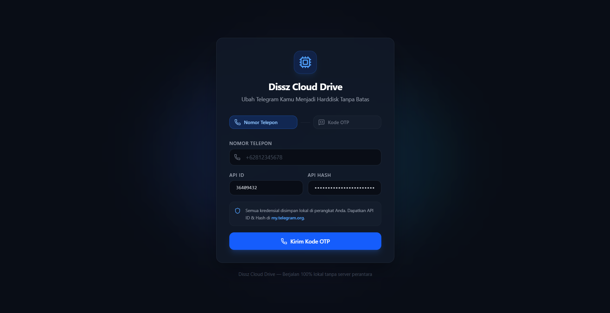
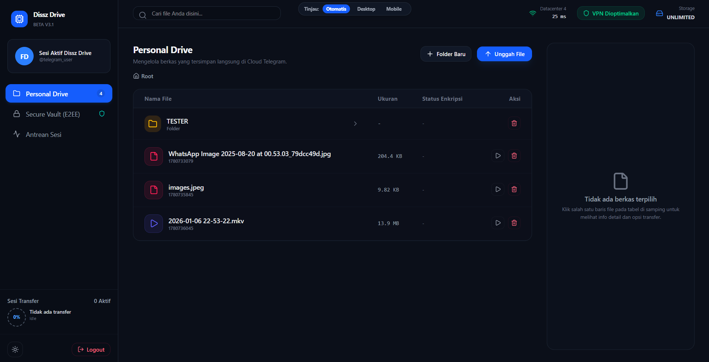

# <div align="center">☁️ Dissz Cloud Drive</div>

**Dissz Cloud Drive** adalah aplikasi desktop open-source modern yang mengubah akun Telegram Anda menjadi media penyimpanan cloud pribadi yang aman, terorganisir, dan tanpa batas. Aplikasi ini dibangun dengan memanfaatkan kekuatan **Tauri v2 (Rust)** di sisi backend untuk performa tinggi dan keamanan maksimal, serta **React (TypeScript)** dan **Tailwind CSS** di sisi frontend untuk antarmuka pengguna yang responsif, modern, dan elegan.

<div align="center">

[](LICENSE)
[]()
[](https://v2.tauri.app/)
[](https://www.rust-lang.org/)
[](https://react.dev/)
[](https://www.typescriptlang.org/)

</div>

---

## ❓ Apa itu Dissz Cloud Drive?

Aplikasi ini bertindak sebagai jembatan cerdas antara komputer lokal Anda dan infrastruktur cloud Telegram menggunakan Telegram API resmi. Berbeda dengan aplikasi penyimpanan biasa, **Dissz Cloud Drive** mengelola struktur data Anda secara mandiri melalui database SQLite lokal, memungkinkan Anda membuat direktori, memecah berkas besar (*file splitting*), mengunci brankas rahasia (*Secure Vault*), serta mengunggah folder rekursif secara otomatis—sepenuhnya gratis memanfaatkan kapasitas tak terbatas dari Telegram.

### ✨ Fitur Utama

* **🔒 Privasi & Keamanan 100% Lokal**: Seluruh kredensial API, kunci enkripsi, dan file sesi biner (`telegram.session`, `config.json`, `storage.db`) disimpan secara lokal di direktori sistem komputer Anda (`AppData` / `Application Support`). Tidak ada server perantara pihak ketiga.
* **🛡️ Secure Vault (Zero-Knowledge AES-256 E2EE)**: Modul brankas rahasia lokal yang dilindungi sandi tersendiri untuk mengamankan berkas sensitif dengan enkripsi tingkat tinggi sebelum disimpan ke cloud.
* **🔐 Local App Lock Screen**: Kunci akses aplikasi lokal dengan password kustom untuk melindungi seluruh tampilan drive saat dibuka kembali tanpa perlu mengulang alur login Telegram.
* **🔑 Autentikasi Telegram Resmi**:
    * **OTP Via Nomor Telepon**: Meminta dan memverifikasi kode login langsung dari Telegram resmi.
    * **Password 2FA**: Dukungan penuh verifikasi keamanan tambahan jika akun Telegram Anda mengaktifkan Two-Factor Authentication.
* **🗄️ Manajemen Database SQLite Lokal**: Melacak struktur hierarki folder bersarang (*nested folders*), metadata berkas (ukuran asli, format, status enkripsi, Telegram Message ID), dan log status transfer.
* **📁 Unggah & Kelola Folder Rekursif**: Pembuatan folder bersarang serta pengunggahan seluruh isi direktori beserta sub-folder secara otomatis.
* **⚡ Real-Time Transfer Queue**: Pemantauan aktivitas unggah dan unduh berkas secara real-time yang dilengkapi indikator persentase, ukuran berkas, serta kalkulasi kecepatan (*bytes/sec*).
* **🖼️ Pratinjau Berkas Media**: Pratinjau gambar, video, dan audio langsung di dalam aplikasi melalui sistem cache lokal.
* **📱 Dual-Layout UI System**: Antarmuka responsif cerdas yang mendukung tampilan **Desktop SaaS Minimalis** dan **Mobile Touch-First View** (dengan *Bottom Navigation* dan *Detail Drawer*).
* **🌓 Tema Fleksibel (Dark Mode / Light Mode)**: Kustomisasi tema visual penuh yang ramah mata untuk kenyamanan penggunaan.

---

## 📸 Tangkapan Layar (Screenshots)

| 🔐 Halaman Autentikasi (Login) | 🖥️ Dasbor Utama (File Explorer) |
|:---:|:---:|
|  |  |

---

## 🛠️ Tech Stack (Teknologi)

* **Core Backend Framework**: [Tauri v2](https://v2.tauri.app/) (Arsitektur aplikasi desktop berbasis Rust yang efisien, aman, dan ringan).
* **Programming Language Backend**: [Rust](https://www.rust-lang.org/) (Performa tinggi, manajemen memori aman, dan manipulasi I/O biner cepat).
* **Telegram MTProto Client**: `grammers` (Framework asynchronous Rust MTProto untuk komunikasi langsung dengan server Telegram).
* **Local Database Engine**: SQLite via `sqlite` crate (Manajemen relasional terenkripsi untuk berkas dan direktori lokal).
* **Frontend Ecosystem**: React 19, TypeScript, Vite (Komponen UI berbasis komponen yang modular dan bertipe data kuat).
* **Styling Engine**: Tailwind CSS (Desain antarmuka utilitas minimalis, modern, dan responsif).

---

## 🚀 Memulai (Getting Started)

### 📋 Prasyarat Sistem

Sebelum melakukan kompilasi proyek ini, pastikan sistem komputer Anda telah terpasang *tools* berikut:
1. **Node.js (v18 ke atas)**: [Download Node.js](https://nodejs.org/)
2. **Rust Toolchain (Latest Stable)**: Instal via terminal atau biner installer:
   * *macOS/Linux:* `curl --proto '=https' --tlsv1.2 -sSf https://sh.rustup.rs | sh`
   * *Windows:* Unduh biner `rustup-init.exe` dari [rustup.rs](https://rustup.rs/)
3. **C++ Build Tools (Khusus Windows)**: Wajib terpasang via [Visual Studio Build Tools] dengan beban kerja (*workload*) **"Desktop development with C++"**.

### 🔑 Kredensial Telegram API

1. Masuk ke portal pengembang Telegram di [my.telegram.org](https://my.telegram.org).
2. Pilih menu **"API development tools"**.
3. Buat aplikasi baru untuk mendapatkan `api_id` dan `api_hash` Anda sendiri.

---

### 💻 Langkah Instalasi & Pengoperasian Lokal

1. **Clone Repositori**
   ```bash
   git clone https://github.com/caamer20/Telegram-Drive.git
   cd dissz-cloud-drive
   ```

2. **Instalasi Dependensi Frontend**
   ```bash
   npm install
   ```

3. **Jalankan Aplikasi dalam Mode Dev (Development)**
   ```bash
   npm run tauri dev
   ```
   *(Catatan: Kompilasi pertama kali akan menyusun Rust crates pendukung, proses ini memakan waktu beberapa menit tergantung spesifikasi hardware Anda).*

4. **Kompilasi Aplikasi Menjadi Installer Jadi (`.exe` / `.app` / `.deb`)**
   ```bash
   npm run tauri build
   ```
   Hasil biner terkompilasi dapat ditemukan di dalam direktori `src-tauri/target/release/bundle/`.

---

## 📄 Lisensi (License)

Proyek ini didistribusikan di bawah **MIT License**. Lihat berkas [LICENSE](LICENSE) untuk detail aturan selengkapnya.

---

<div align="center">
  <sub>Developed with ❤️ by <b>DISSZ DEV</b> (Fahri Adis Al Hafni) - Universitas Dr. Soetomo, Surabaya.</sub><br>
  <sup><i>Disclaimer: Aplikasi ini adalah proyek independen dan tidak berafiliasi dengan Telegram FZ-LLC secara resmi. Gunakan dengan bijak sesuai dengan Ketentuan Layanan Telegram.</i></sup>
</div>